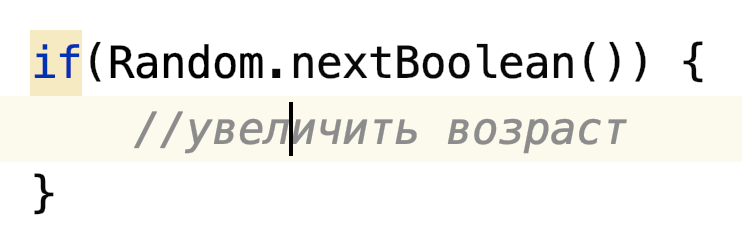

# Задача

## Цели домашнего задания

* Создать собственную иерархию классов.
* На практике рассмотреть принципы инкапсуляции и наследования.
* На практике рассмотреть особенности работы с родительскими и производными классами.

## Что нужно сделать

Разработать консольную программу, имитирующую жизненный цикл животных в заповеднике.

1. Создайте класс животного Animal.

2. У животного должны быть характеристики:

    * энергия,
    * вес,
    * текущий возраст,
    * максимальный возраст,
    * имя.

3. Добавьте вычисляемое свойство isTooOld — Boolean. Оно должно сравнивать текущий возраст с максимальным и возвращать
   true, если текущий возраст равен или больше максимального.

4. Животное может спать, питаться и передвигаться.

Во время сна:

* Энергия животного увеличивается на 5, а возраст — на 1.
* В консоль выводится сообщение: «${имя животного} спит».

Во время питания:

* Энергия животного увеличивается на 3, а вес — на 1.
* Возраст животного может увеличиться на 1.
* В консоль выводится сообщение: «${имя животного} ест».

Во время передвижения:
* Энергия животного уменьшается на 5, а вес — на 1. 
* Возраст животного может увеличиться на 1. 
* В консоль выводится
сообщение: «${имя животного} передвигается».
  
5. Случайное увеличение возраста реализуйте с помощью класса Random из пакета kotlin.random и метода.nextBoolean().

Пример использования:

Вынесите случайное увеличение возраста в метод — tryIncrementAge

Если животное слишком старое, если не хватает веса или энергии для совершения действия, то ничего не происходит.

6. Животное может производить потомство.

Имя и максимальный возраст у рождённого животного такие же, как и у родителя.

Энергия для рождённого животного устанавливается случайно в диапазоне от 1 до 10.

Вес для рождённого животного устанавливается случайно в диапазоне от 1 до 5.

В консоль должно выводиться сообщение о том, какое животное было рождено и какие у него характеристики.

7. Создайте наследников класса Animal: Bird, Fish, Dog.

8. В каждом из наследников переопределите функцию, отвечающую за передвижение. Для каждого наследника в этой функции
   необходимо вызвать родительскую реализацию и дополнительно вывести в консоль сообщение:

 * для Bird — «летит», 
 * для Fish — «плывет»,
 * для Dog — «бежит».

По желанию: добейтесь, чтобы дополнительное сообщение
выводилось только если выполнилась родительская реализация.

9. В каждом из наследников переопределите функцию, отвечающую за рождение потомка. Класс Fish должен возвращать объект
   класса Fish. Аналогично с Bird и Dog.

10. Создайте класс NatureReserve, который представляет собой заповедник с разными животными.

11. Инициализируйте заповедник. Изначально в нём должно быть пять птиц, три рыбы, две собаки и несколько обычных
    животных.

_По желанию:_ создайте дополнительные виды животных и добавьте их в заповедник.

12. Напишите программу, которая имитирует жизненный цикл животных в заповеднике.

В течение ограниченного числа итераций N каждое животное делает одно случайное действие, которое позволяют сделать его
свойства: ест, спит, двигается, рожает.

Когда у животного рождается детёныш, он добавляется к общему количеству животных заповедника.

В конце итерации все животные, у которых возраст превысил максимальный, удаляются из заповедника.

По окончании работы должно выводиться число животных в заповеднике, которые остались живы.

Если все животные исчезли — программа должна прерываться, с выводом соответствующего сообщения.